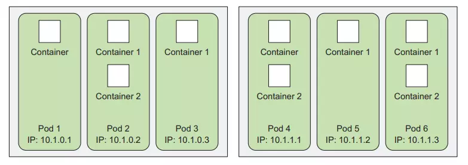

# Kubernetes

## Overview
>  + **Kubernetes** is a open source platform, it is used to automate the management, scaling and deployment of application in the form of containers, also known as **Container Orchestration engine**. Kubernete help us eliminate many of the manual process regarding deploying and scaling containerized applications. 
>  + **Kubernetes orchestration** allows us to build scalable application services with multiple containers. It schedeles those containers on a cluster, scales the containers and manages the state of containers over time
>  + **Kubernetes** is a powerful tool developed by **Google**

## Definition

#### Clusters
A **Kubernetes Cluster** is a collection of virtual or physical machines used by Kubernetes. Those virtual or physical machines are **nodes**, including **master and worker nodes**. *Those nodes need to install docker and Kubernetes*


#### Nodes
**Kubernetes nodes** are virtual or phisical machines running kubernete. Those node need to install Kubernetes and Docker, and *each of those node is a docker host*

Node is a smallest unit of computing hardware in Kubernetes. It is a representation of a **signle machine** in a Kubernetes cluster. 

In most of **Kubernetes System**, a node will either be an actual **physical machine** or a **virtual machine** of a clound platform as **Google Clound Platform** or **AWS**, or simply a **virtual machine** created by **VirtualBox**

We can simply understand each **node** as **a set of CPU and RAM resources** that can bu used. *This way, any machine can replace any other machine in the Kubernetes cluster*

#### Pods
Pods are the most basic component in a Kubernetes system. Pods located in worker nodes are where one or more container. Each pod is like logical machine (with its own IP, hostname and process)


When an application is packaged, that application will be able to run on a standalone container. Although we can run standalone container like lauching a monolytic application. But Kubernetes will not run that way. Kubernetes will use the **pod** concept to **group containers with together**. *A pod is a group of container*, those container will share the resources and networks. 

*Containers in a pod can maintain communication with each other like on a server but sill maintain the necessary independence.*

*With Kubernetes, the unit when scaling an application will be scale of pod. Therefore, pod usually is a group of containers with the same using purpose*

##### Why do we need Pods?
> Why do we need Pods? Why don't we run containers directly in the worker nodes?

Actually, **Pods** are the **higher level of container**, they can **contain many containers** that **handle the same type of work**. Those **containers will have the same IP address and share the same volume.**

##### The settings for the simple Pods
To create a simple pod on a Kubernete cluster, we will configure the pod parameters with **yml** or **json** file as desired. *Make sure you have a Kubernetes cluster (Local using minikuke)*

`kubia-manual.yaml`
```
apiVersion: v1
kind: Pod
metadata:
  name: kubia-manual
spec:
  containers:
  - image: luksa/kubia
    name: kubia
    ports:
    - containerPort: 8080
      protocol: TCP
 ```
- **apiVersion**: version of Kubernetes API
- **kind**: specify the component to create (this context will be Pod)
- **metadata**: pod name
- **Spec**: description of pod's information (Spec = Specifications)
- **containers**: contains the name of container to run inside pod
- **name**: container name
- **containerPort**: the output port of container

To create pods, we use the `kubectl create` command
```
kubectl create -f kubia-manual.yaml
 ```

 The notification will appear immediately after running the command
 ```
 pod "kubia-manual" created
 ```

Checking pods
```
kubectl get pods

NAME         READY  STATUS   RESTARTS AGE
kubia-manual 1/1    Running    0      32s
```

##### Organize pods with labels
In the medium or large system, the number of pods deployed on the Kubernetes cluster reaches dozens, even hundreds... If there is no machanism or solution to well organize pods in such a large number. They will become a **jumbled, chaotic mess**, as a result, it take a lot of effort to manage. With **Lable**, we can devide many pods into a smaller group.

*Note: Lable can be assigned to a lot of nodes, not just pods*


With the pods in the image above, we can orgainize by assigning 2 labels for each pods
- **app**: specify this pod belongs to which part of the application such as UI or Order Service...
- **rel**: specify this pod is used for which version of the application such as stable, beta or canary


##### Organize pods with labels

```
apiVersion: v1
kind: Pod
metadata:
  name: kubia-manual-v2
  labels:
    app: ui
    rel: stable
spec:
  containers:
  - image: luksa/kubia
    name: kubia
    ports:
    - containerPort: 8080
      protocol: TCP
```

A little different from the pods configuration yml file above. In the metadata section we have added **labels for pods**. There are two new labels consisting of **app** and **rel**

After creating pods by using `kubectl create -f`, we use this command:
```
kubectl get po --show-labels
kubectl get pod --show-labels
kubectl get pods --show-labels
```

Console will show the pods with corresponding label


#### ReplicationController
In reallity, pods running on the Kubernetes clusters can completely fail or die unexpectedly for many differenct reasons. With **ReplicationController**, it will ensore to recreate new pods to replace when old **pods fail or nodes fail**. More fully, *ReplicationControllers will maintain the number of running pods with a pre-specified number*

##### The structure of ReplicationControllers

- **label selector**: identify the pods that Controller will manage by label
- **replica cound**: number of pods need to be maintained
- **pod template**: it is understood as a template of pods for the Controller to use to create new Pods when needed.

##### Create a ReplicationControllers
Create file `kubia-rc.yaml`

```
apiVersion: v1
kind: ReplicationController
metadata:
  name: kubia
spec:
  replicas: 3
  selector:
    app: kubia
  template:
    metadata:
      labels:
        app: kubia
    spec:
      containers:
        - name: kubia
          image: luksa/kubia
          ports:
            - containerPort: 8080
```
- **kind**: kind of ReplicationController
- **replicas**: 3 is a number of pods that need to maintain
- **app**: **kubia** that means that will apply for pods that have labels **app: kubia**
- **template**: is the pod template part, describing the image, port to be able to run containers in pods

Create a ReplicationController with command:
```
$ kubectl create -f kubia-rc.yaml
replicationcontroller "kubia" created
```

We can delete a pod with command:
```
kubectl delete pod [pod-name]
```

As you can see, There is a new pod immediately created to replace the deleted pod


#### Service
> A bridge for components in the Kubernetes system to be able to interact with each other

*As you know, each pod have their own IP and hostname containing application containers. Client can connect to pods to communicate by using corresponding IP or hostname. However, there is a issue that Pods can be crash or have unexpected errors. When ReplicationController create new pods if there is a pod is terminated, this pod will also get the new IP and hostname. Furthermore, an application deployed on Kubernetes has many pods running at the same time, so the client should not and not nessary to store dozens of ip addresses and hostnames of the pods. This is when we need to use **Service***

**Kubernetes Service** is a resource that allows creating a signle point of access to pods that provide the same service. Each service will have a constant IP address and Port. Client can open the connection to access to the IP address and port of the service, and then which will be redirect to the pods for handling.


##### Create service by using yaml file
Create file name `kubia-svc.yaml`

```
apiVersion: v1
kind: Service
metadata:
  name: kubia
spec:
  ports:
    - port: 80
      targetPort: 8080
  selector:
    app: kubia
```

- **kind**: kind of pod is service
- **port**: 80 represents that the port interacting with the service is port 80
- **targetPort**: 8080 is a port of containers inside the pods that service will redirect to it
- **app**: kubia (selector section) represents that the service interacting with pods have labels `app=kubia`

At the `spec` section, we can add 1 more field `type` representing the type of service to use (defailt is `ClusterIP`). Type of services incude:
- **ClusterIP**: service only has a local IP address and is only accessible from components inside the cluster Kubernetes
- **NodePort**: service can interact through Port of worker nodes in cluster
- **LoadBlancer**: service only has IP public, can contact anywhere
- **ExternalName**:  map service to 1 DNS name

Create service with this command
```
kubectl create -f kubia-svc.yaml
```

Check running services with this command
```
$ kubectl get svc
NAME        CLUSTER-IP    EXTERNAL-IP  PORT(S) AGE
kubernetes  10.111.240.1    <none>      443/TCP 30d
kubia       10.111.249.153  <none>      80/TCP 6m 
```

We can completely configure for service for more than 1 port. In the below file, we config port to interact with service for http and https protocol corresponding with two ports 8080 and 8443 in container.

```
apiVersion: v1
kind: Service
metadata:
  name: kubia
spec:
  ports:
  - name: http
    port: 80
    targetPort: 8080
  - name: https
    port: 443
    targetPort: 8443
  selector:
    app: kubia
```

##### Service NodePort
As above, after creating the service and using `kubectl get svc` command to check the newly created service. We can also see that there are two IP parameters, CLUSTER_IP and EXTERNAL_IP, with the value \<none>
- **CLUSTER_IP**: is a local IP address insde the Cluster Kubernetes, with this IP address, Pods and service can interact with each other, but outsiders will not be able to interact with the service through it.
- **EXTERNAL_IP**: IP address public, outside client can use to this IP address to interact with this service or anywhere.

Type NodePort helps service be able to interact with outsiders through port of worker node.

Create file `kubia-svc-nodeport.yaml`
```
apiVersion: v1
kind: Service
metadata:
  name: kubia-nodeport
spec:
  type: NodePort
  ports:
    - port: 80
      targetPort: 8080
      nodePort: 30123
  selector:
    app: kubia
```

Use this command to create
```
kubectl create -f kubia-svc-nodeport.yaml
```
- **nodePort**: a port of node worker is opened to outsiders can interact with service

Check service detail
```
$ kubectl get svc kubia-nodeport
NAME           CLUSTER-IP      EXTERNAL-IP   PORT(S) AGE
kubia-nodeport 10.111.254.223   <nodes>      80:30123/TCP 2m
```

When interacting with service, client will access through `<public IP Address of Node>:Port`


##### Service Load Blancer
Create a service **LoadBalancer** will provide more public IP address to outside client can send the request to them


Create file `kubia-svc-loadbalancer.yaml`
```
apiVersion: v1
kind: Service
metadata:
  name: kubia-loadbalancer
spec:
  type: LoadBalancer
  ports:
    - port: 80
      targetPort: 8080
  selector:
    app: kubia
```

Create service
```
kubectl create -f kubia-svc-loadbalancer.yaml
```

Check service with this command
```
$ kubectl get svc kubia-loadbalancer
NAME               CLUSTER-IP      EXTERNAL-IP     PORT(S) AGE
kubia-loadbalancer 10.111.241.153  130.211.53.173  80:32143/TCP 1m
```

#### ReplicaSets
As you know at the previous secsion, we already mentioned the concept of **ReplicationControllers** that is a component of the Kubernetes system, help to manage the state of pods as well as always-available nodes.

The responsibility of **ReplicaSets** in Kubernetes also similer to the **ReplicationControllers**, more precisely, ReplicaSets were introduced to replace **ReplicationControllers**

##### The difference between ReplicaSets and ReplicationControllers
- **ReplicationControllers** can only be directly created by configuring a **yaml file** or directly used by command line with **Kubectl**. **ReplicaSets** is similar to **ReplicationControllers**, moreover, it can be automatically created when we initialize a Deployment object
- **ReplicaSets** can be configured to apply for many label values in the same field. **ReplicationControllers** can only be applied for pods that have one value for each labels field. For example, **ReplicaSets** can be applied to pods with labels env=production, env=development, etc, and **ReplicationControllers** can only be applied for pods with labels env=development.


#### Volumes
As you know, Kubernetes system will create new pods to replace when a pod fails, dies or crashes. *So where does the data stored in the pods go? Can the new pods regain the data of lost old pod to continue using?*. The **Volume** concerpt will help solve the above problems.

Volumes is a component of pod. Volumes is defined in the configuration yaml file when initializing pods. Containers **can mount data inside container to the volumes object that belongs to the same pod**.
<p align="center">
  
</p>

##### Type of Volumes
- emptyDir
- hostPath
- gitRepo
- nfs
- Cloud volumes: gcePersistentDisk (Google Compute Engine Persistent Disk), awsElasticBlockStore (Amazon Web Services Elastic Block Store Volume), azureDisk (Microsoft Azure Disk Volume).
- cinder, cephfs, iscsi, flocker, glusterfs, quobyte, rbd, flexVolume, vsphereVolume, photonPersistentDisk, scaleIO:
- configMap, secret, downwardAPI:
- persistentVolumeClaim:

###### EmptyDic
This is a simplest type of volume. Initially just an empty folder, containers can use emptyDic volume to read, write and share for other containers in the same pods. When the pods is crashed or are deleted, the empty volume are also lost along with the data in them.

Create file `fortune-pod.yaml` to create a EmptyDir volume
```
apiVersion: v1
kind: Pod
metadata:
  name: fortune
spec:
  containers:
    - image: luksa/fortune
      name: html-generator
      volumeMounts:
        - name: html
          mountPath: /var/htdocs
    - image: nginx:alpine
      name: web-server
      volumeMounts:
        - name: html
          mountPath: /usr/share/nginx/html
          readOnly: true
      ports:
        - containerPort: 80
          protocol: TCP
  volumes:
    - name: html
      emptyDir: {}
```
Explain for above configuration file
- Pod contains 2 containers are `html-generator`, `web-server`.
- The folder of `html-generator` is mounted with **volumes** is `/var/htdocs`
- The folder of `web-server` is mounted with **volumes** is `/usr/share/nginx/html` with `readOnly` mode (just get the date from volume to container)

In above example, container `html-generator` will update the file `index.html` in folder `/var/htdocs` each 10 second. When the file is updated completely, it will update to the volumes and then container `web-server` can read it. When the client sent the request to the container `web-server` nginx, the data will be returned to file `index.html`
- 3 the last lines contain the information regarding volumes name and type of volume is `emptyDir`. Default, `emptyDir` will use the resources of hard drive of `worker nodes` to store. There is a another option is use RAM of `worker node`
```
volumes:
     - name: html
     emptyDir:
         medium: Memory
```


<br/><hr/>
## References
- [Những khái niệm cốt lõi trong Kubernetes (Phần 1) - Le Thanh Cong](https://viblo.asia/p/nhung-khai-niem-cot-loi-trong-kubernetes-phan-1-RQqKL9wzZ7z)
- [Những khái niệm cốt lõi trong Kubernetes (Phần 2) - Le Thanh Cong](https://viblo.asia/p/nhung-khai-niem-cot-loi-trong-kubernetes-phan-2-bWrZnxxm5xw)